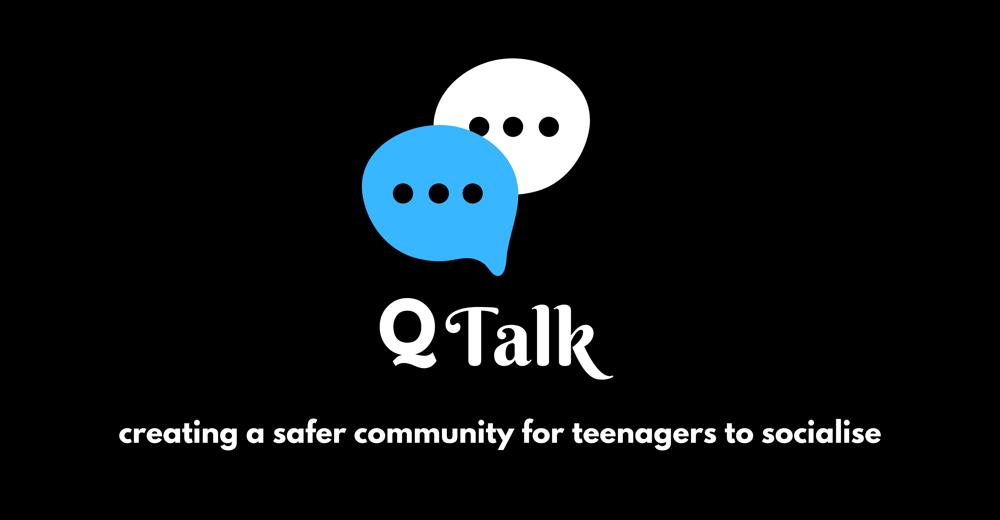
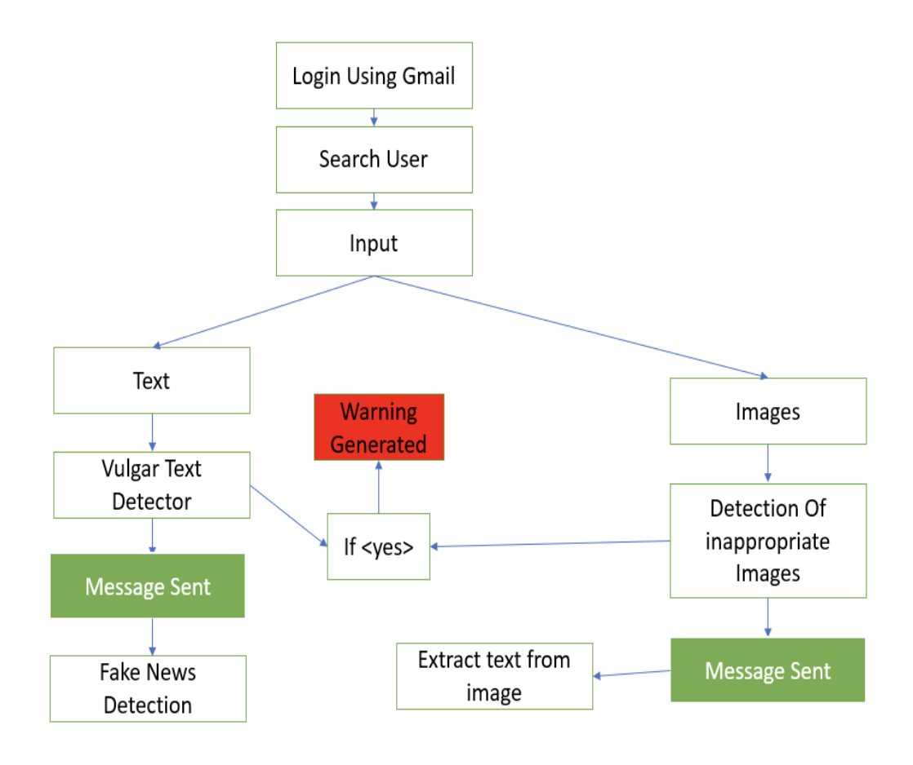
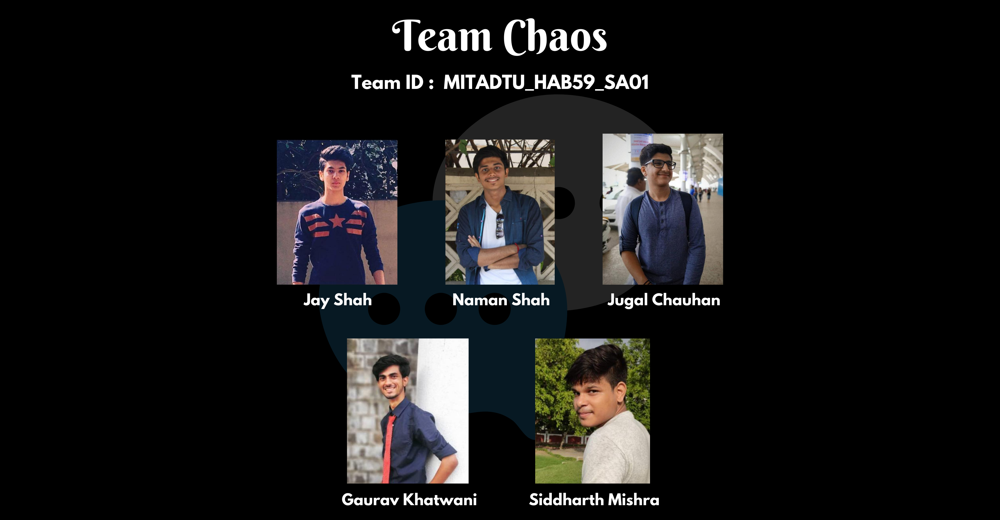

<!-- PROJECT LOGO -->
<br />
<p align="center">
  <a href="https://github.com/shahnamana/QTalk">
    
  </a>

  <h3 align="center">An awesome Chat Application developed during Hackathon59</h3>

  <p align="center">
    <a href="https://github.com/shahnamana/QTalk"><strong>Explore the docs »</strong></a>
    <br />
    <br />
    <a href="https://github.com/shahnamana/QTalk#Demonstration">View Demo</a>
    .
    <a href="https://github.com/shahnamana/QTalk/issues">Report Bug</a>
    ·
    <a href="https://github.com/shahnamana/QTalk/issues">Request Feature</a>
  </p>
</p>


<!-- TABLE OF CONTENTS -->
## Table of Contents

* [Usage](#usage)
* [About the Project](#about-the-project)
  * [Built With](#built-with)
* [Getting Started](#getting-started)
  * [Prerequisites](#prerequisites)
  * [Installation](#installation)
* [Demonstration](#Demonstration)
* [System Design](#system-design)
* [System Implementation](#system-implementation)
* [Conclusion and Future Scope](#Conclusion-and-Future-Scope)
* [Contributing](#contributing)
* [Our Team](#Our-Team)

<!-- USAGE EXAMPLES -->
## Usage

Are kids being on social media, parents' greatest online fear ? 
<br />
Aren’t parents concerned about their child’s privacy ?
- the explicit and inappropriate content shared online ?
- fear of cyberbullying ?
- the sexual exploitation ?
- the cyber threats ?
- And the dangerous propaganda all over the internet ?

<br />
Don't you think teenagers should be safe online just as they are in everyday life ?

<br />
We developed a Chat App where teenagers can be safe and have fun at the same time. 

<br />
QTalk helps kids connect and have fun with their friends.


<!-- ABOUT THE PROJECT -->
## About The Project
<p align="center">
    <a href="https://github.com/shahnamana/QTalk">
    
</p>
<p align="center">
Qtalk is a Mobile Chat Application which is similar to WeChat (Chinese App) and comes with more features like censored in the terms of sharing content and chats.
</p>

### Built With
Our app is built using the following technologies:
* [Flutter](https://flutter.dev)
* [Firebase](https://firebase.google.com)
* [Tensorflow](https://www.tensorflow.org)
* [Keras](https://keras.io)
* [CNN ](https://en.wikipedia.org/wiki/Convolutional_neural_network)


<!-- GETTING STARTED -->
## Getting Started

This is an example of how you may give instructions on setting up your project locally.
To get a local copy up and running follow these simple example steps.

### Prerequisites

This is a list things you need to use the software and how to install them on your mobile phones:

* A valid Google Account
* Memory Space of 100mb in the device
* For Android Users : Android 4.1 and above
* For iOS Users : iOS 8 and above
* User shall provide App Permissions when asked

### Installation

#### To install on simulator using Android Studio:
1. Clone the repo
```sh
git clone https://github.com/shahnamana/QTalk/tree/master/Flutter.git
```
2. Add QTalk project on AndroidStudio
3. Link your Active Firebase Account to the project 
4. Install required flutter packages on AndroidStudio
```sh
flutter pub get
```
5. Connect Simulator to AndroidStudio
6. Run the main.dart file

#### To install the App on Android Phones:
1. Download the APK file from the link given : 
[Download APK](https://drive.google.com/drive/folders/1mlQZV3QwbW09TozY6Yaae2O4AqxPgVaM)
2. Install the App on your mobile phone

#### To install the App on iOS devices:
We will soon publish the App on the App Store. Stay Tuned

<!-- Demonstration -->
## Demonstration
To view the demonstration of our app and other documents:
* [Video Demonstration](https://drive.google.com/drive/folders/1mlQZV3QwbW09TozY6Yaae2O4AqxPgVaM)
* [Presentation](https://drive.google.com/drive/folders/1mlQZV3QwbW09TozY6Yaae2O4AqxPgVaM)
* [Report](https://drive.google.com/drive/folders/1mlQZV3QwbW09TozY6Yaae2O4AqxPgVaM)
* [Marketing Demo](https://drive.google.com/drive/folders/1mlQZV3QwbW09TozY6Yaae2O4AqxPgVaM)

<!-- System Design -->
## System Design

<p align="center">
    <a href="https://github.com/shahnamana/QTalk">
    
</p>


<!-- System Implementation -->
## System Implementation

* Login System: The Login System is integrated with Firebase for WebRTC (Web Real-Time Communication), user registration and authentication for login purposes and only google authorized users can log in.
* Vulgar Text Detection: The text input given by user is passed through comparison of string and if it found to be vulgar or inappropriate use of words or threats then the warning message is generated
* Fake News Detection: The text is further passed through Bing Search News API, And once the message is sent, a pop up appears which tells about the truth value of the message. We have developed a FLASK API and uploaded on a hosting platform so anyone with the APK can check and validate the news.
* Obscene Image Detection: The image given by the user is passed through the ML kit firebase and if found true then the message is discarded and a warning message is shown.
* Text Extraction: For extracting text from the image we have used ML kit offered by Firebase. It is used because the accuracy is very high and Google has offered support to all models thus providing better and more accurate outputs.

<!-- Conclusion and Future Scope -->
## Conclusion and Future Scope
For future scope the app can have :
* A better UI as compared to the current one.
* More file sharing options(currently only image sharing is possible in jpg, jpeg and png
formats).
* Frequently contacted chats on the home page.
* Video calling and normal audio calling feature.
* Restriction of features based on age.
* Better accuracy for fake news detection.

<!-- CONTRIBUTING -->
## Contributing

Contributions are what make the open source community such an amazing place to be learn, inspire, and create. Any contributions you make are **greatly appreciated**.

1. Fork the Project
2. Create your Feature Branch (`git checkout -b feature/AmazingFeature`)
3. Commit your Changes (`git commit -m 'Add some AmazingFeature'`)
4. Push to the Branch (`git push origin feature/AmazingFeature`)
5. Open a Pull Request

<!-- Our Team -->
## Our Team
<br />
<p align="center">
  <a href="https://github.com/shahnamana/QTalk">
    
  </a>
</p>
